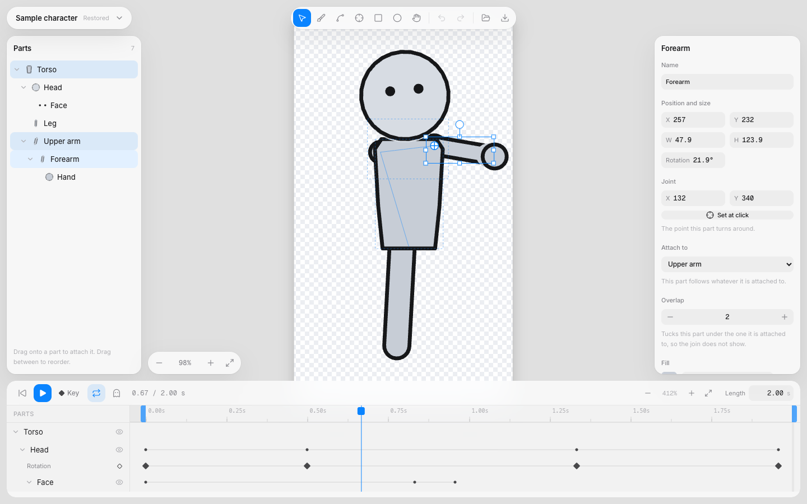

# riff

A browser-based 2D cutout character rig editor. Draw a character out of parts,
attach each part to another, place the joint it turns around, key poses on a
timeline, and export both a JSON rig and a single HTML file that plays the
animation anywhere with no dependencies.



## Quick start

```bash
bun install
bun run dev        # http://localhost:3000
```

The editor opens on a sample character that already waves, so there is something
to take apart before there is something to build.

## First five minutes

1. **Press Play.** The sample waves. Press it again to stop.
2. **Click the Forearm** in the Parts list. Its joint appears on the canvas as a
   crosshair, and the chain it hangs off is outlined faintly.
3. **Type a number into Rotation.** The forearm turns about its elbow, the hand
   follows, the upper arm stays put. That is the whole idea of a cutout rig.
4. **Choose New character** from the menu at the top left, pick the Brush, and
   draw a shape. Finish near where you started and it fills. Every stroke becomes
   a part.
5. **Draw a second shape, then drag it onto the first** in the Parts list. It now
   follows that part, and its joint moves to where the two meet.
6. **Press J and click** where the new part should turn.
7. **Drag the blue line in the timeline, turn the part, press K.** That is a
   pose. Do it twice in two places and press Play.
8. **Press Cmd+E.** You get the character file and a page that plays it.

## Keyboard

| Key | What it does |
|---|---|
| `V` `B` `P` `J` `R` `O` `H` | Select, Brush, Pen, Joint, Rectangle, Ellipse, Move around |
| Space drag, scroll, `Cmd` scroll | Pan, pan, zoom |
| `Shift 1` / `Shift 2` | Fit everything on screen / fit the selection |
| `K` / `Shift K` | Key the selected parts / key every part |
| `G` | Show the pose before and after, faintly |
| `L` | Loop on or off |
| `,` / `.` | Show the previous or next drawing of a part |
| Arrows | Nudge by one, or ten with Shift |
| `Cmd Z` / `Shift Cmd Z` | Undo, redo |
| `Cmd D` / `Shift Cmd M` | Duplicate, mirror |
| `Cmd G` / `Shift Cmd G` | Group, ungroup |
| `Cmd ]` `Cmd [` `Opt Cmd ]` `Opt Cmd [` | Forward, backward, to front, to back |
| `Cmd A`, `Escape`, `Delete` | Select all, deselect, delete |
| `Cmd S` `Cmd O` `Cmd E` | Save here, open a file, export |

## What it exports

`Cmd E` writes two files.

- **The character**, as JSON. One flat table of parts, one of paths, one of
  animation tracks. A part carries its joint, what it is attached to, its
  overlap, its drawings and its transform. Draw order and the skeleton are
  separate lists, because in a cutout rig a back arm hangs off the torso and
  draws behind it.
- **A player**, as one HTML file. One canvas, no libraries, no network. It
  exposes `window.rig.play()`, `.pause()`, `.restart()` and `.goto(frame)`.

Opening accepts either a riff character file or a file from the legacy
single-file studio the project grew out of, and converts the latter.

The model is described in [`docs/handoff.md`](docs/handoff.md); the research
behind the rigging approach is in [`docs/rig/`](docs/rig/).

## Driving it from an agent

Every action the interface performs is also a named tool on `window.riffTools`
(and registered with the WebMCP API when the browser has one). Call
`window.riffTools.list()` for the names, descriptions and input schemas.

They go through the same undo transactions the interface does, so anything a
tool does is undoable and anything a person does is visible to a tool.

## Contributing

Three gates, all of which must be clean:

```bash
bun test            # unit tests
bunx tsc --noEmit   # types
bun run lint        # biome, 0 errors and 0 warnings
```

Read [`AGENTS.md`](AGENTS.md) first: the React Compiler is on, the store lives
outside React, every edit is a transaction, and the visible vocabulary is fixed.

`ref/` holds cloned reference projects and is gitignored. Read it, port from it
with attribution at the top of the ported file, never import from it.

## Licence

MIT. See [`LICENSE`](LICENSE).
